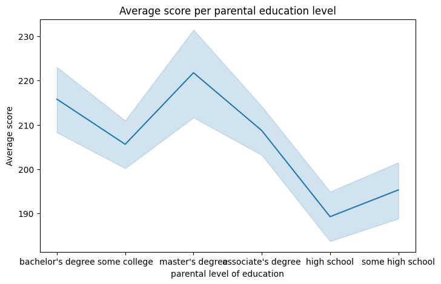
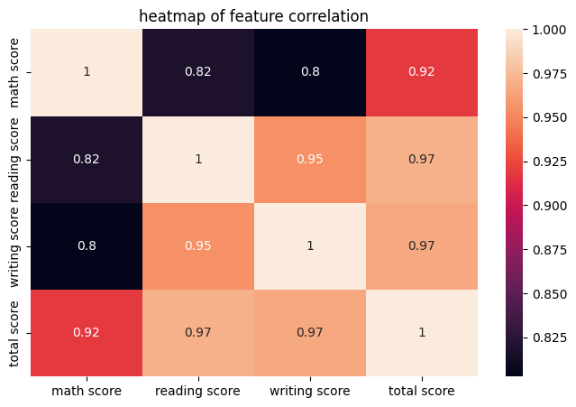
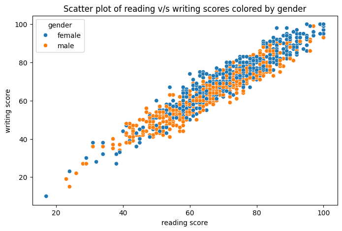

# Student Score Analyzer / Grade Predictor
## a random forest machine learning model using scikit-learn to predict scores of student and flag students at risk early 

this is a jupiter notebook that uses scikit-learn RandomForestRegressor to predict the prediction target = Math_Score , using features = ['reading score','writing score','new gender','new lunch','new test preparation course'].this is my first ml model that uses real life dataset form Kaggle (Student Performance) to predict something meaningful.

# Key features
1. takes in a dataset and visualizes it using  seaborn (line chart, bar chart, heatmap, density plot, histogram, scatter plot) 
2. uses libraries like pandas for data analysis 
3. uses a csv file to store/load the dataset
4. solves a real life problem for teachers to predict/flag at risk students before final assesments

# Figures (charts)

linechart

heatmap

Scatterplot

# How to use it ?
1.download the github repo as zip file / clone the git repo locally
2.run all teh cells in the jupiter notebook 
3.after running replace the sample prediction (new data on which prediction is done) data with actual data in the last cell
4.run the last cell after replacing the data with actual data

# Future Scope
1.use of real datasets to train the model further 
2.using some more efficient ml model than Random Forest
3.deploying this project as a dashboard using streamlit to give it a ui

# Found Any Bugs ?
if any bugs found then make a pull request after fixing it for review and applying the changes

# Liked It ?
if you liked the concept and probably you will like me 😉:
1.gmail = aniketdaiya0910@gmail.com
2.Linkedin = in/aniket-daiya-1473b93a3